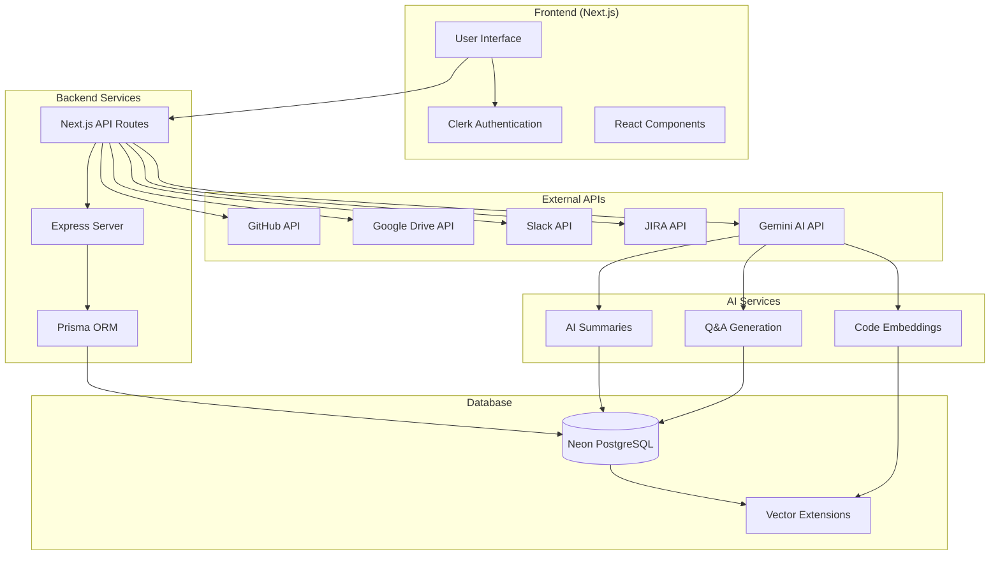
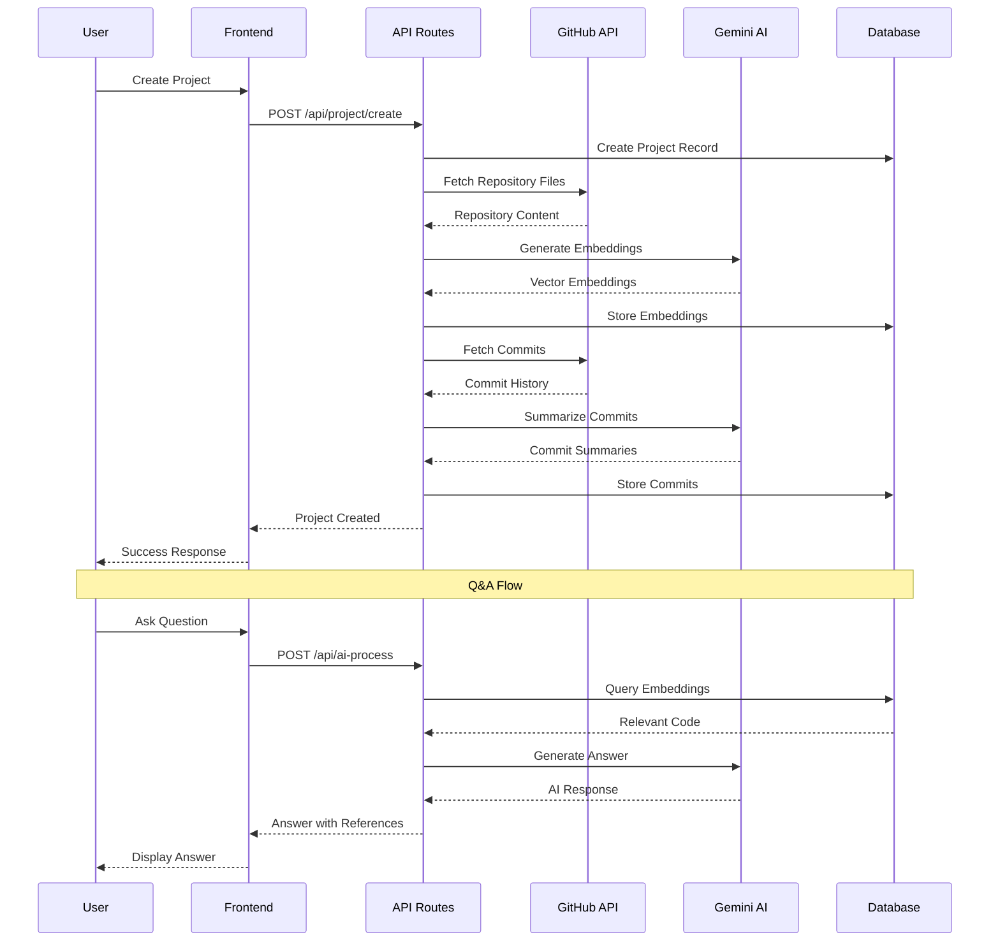
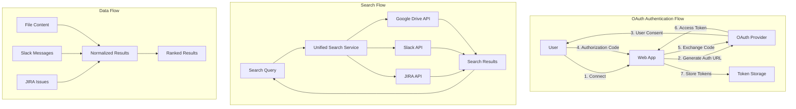
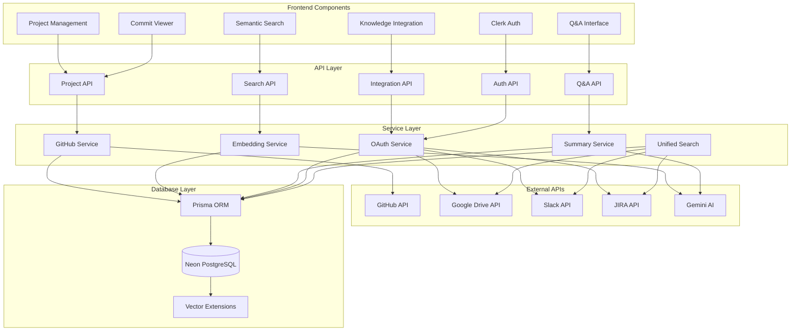
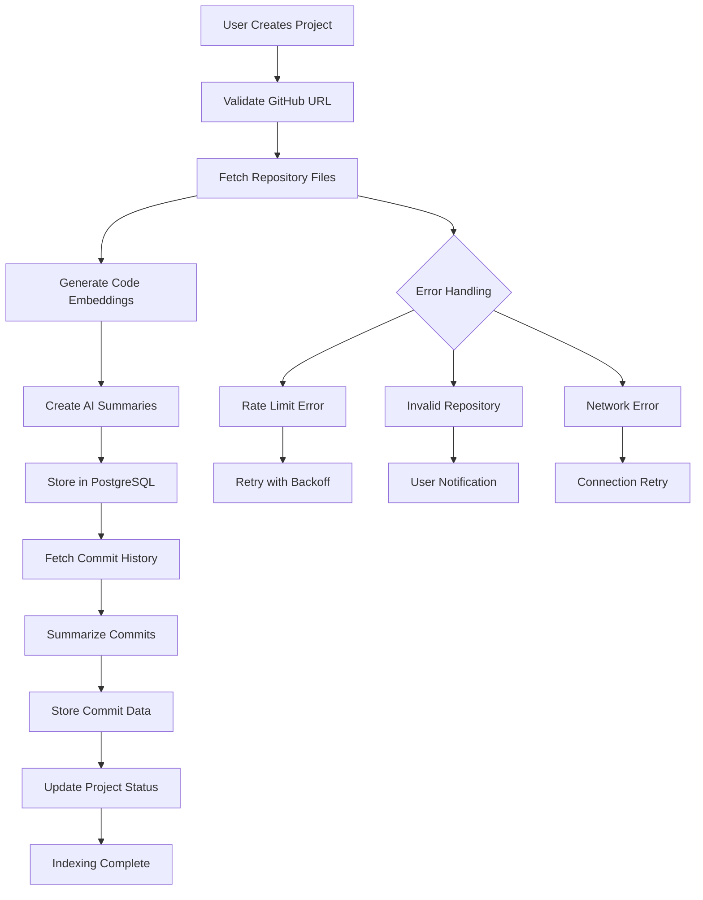
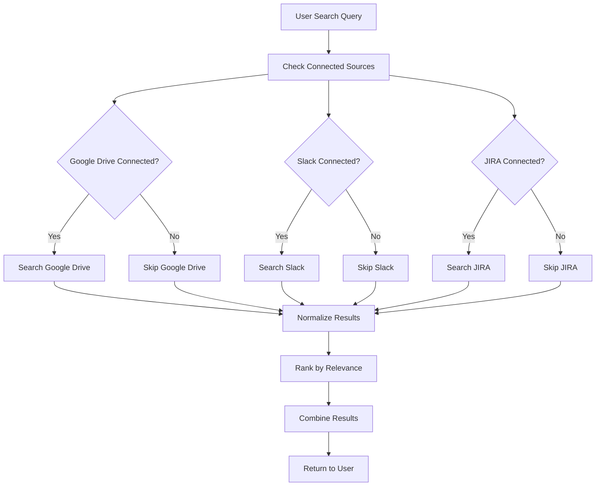
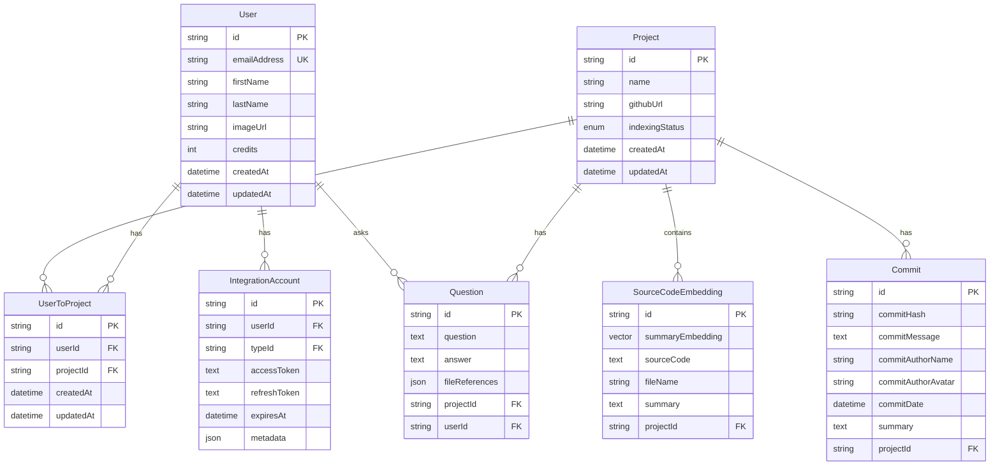
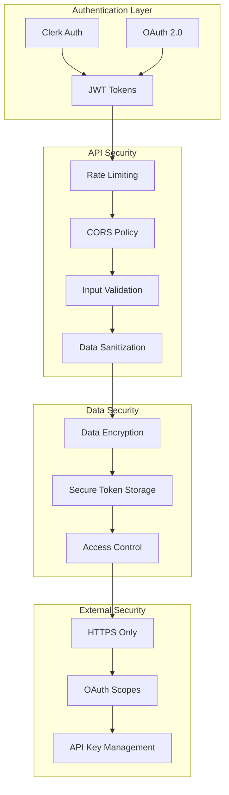
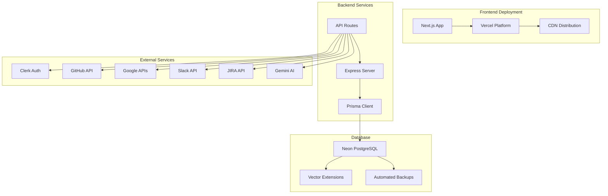
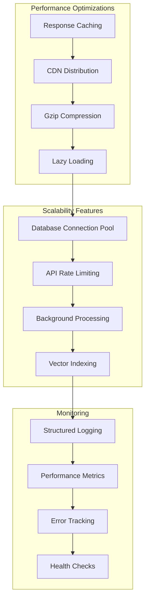

# System Architecture Diagram

## 🏗️ Overall System Architecture

## 🔗 GitHub Integration System

## 🔍 Multi-Source Knowledge Integration System

## 📊 Detailed Component Architecture

## 🔄 Data Flow Diagrams

### GitHub Repository Indexing Flow

### Multi-Source Search Flow

## 🗄️ Database Schema Overview

## 🔐 Security Architecture

## 🚀 Deployment Architecture

## 📈 Performance & Scalability

This comprehensive system diagram shows the complete architecture of your AI Docs platform, covering both the GitHub integration feature and the multi-source knowledge integration system. The diagrams illustrate data flow, component relationships, security measures, and deployment architecture.
